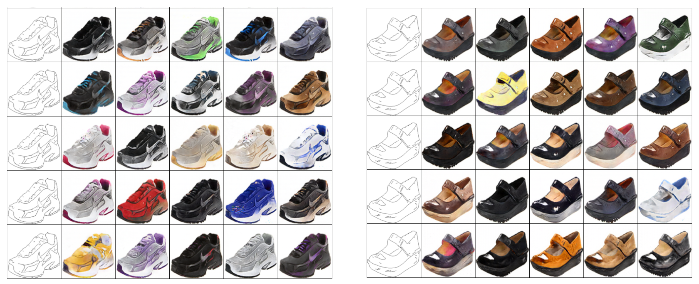
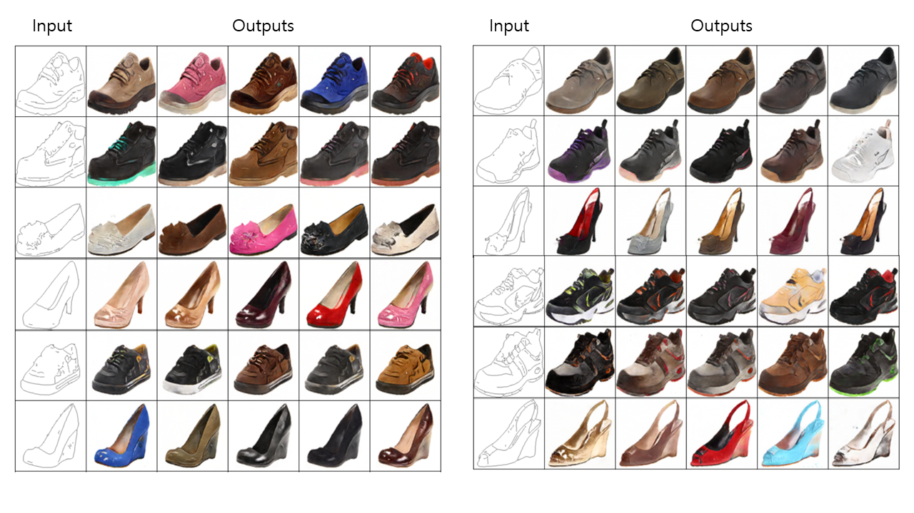
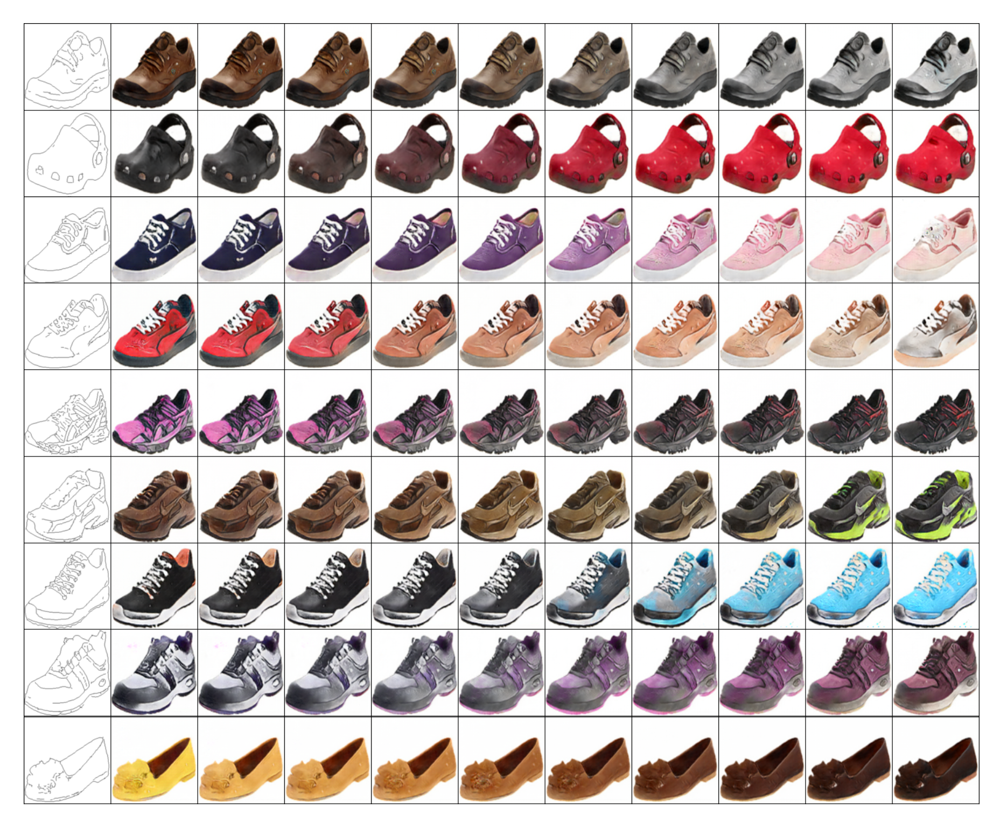
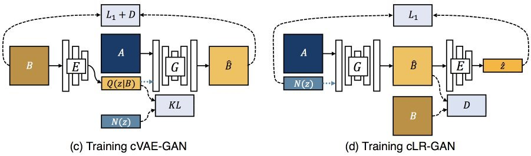
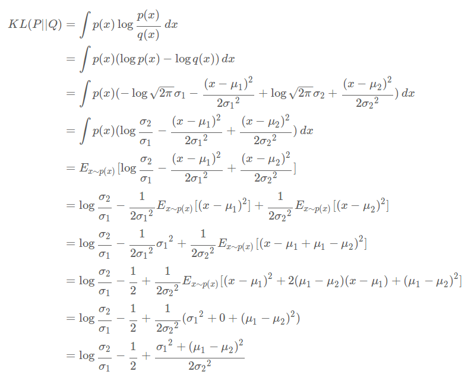
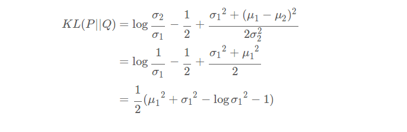

# BicycleGAN-pytorch
__Pytorch__ implementation of [BicycleGAN : Toward Multimodal Image-to-Image Translation](https://arxiv.org/abs/1711.11586).
<p align="center"></p>  

## Result
### Edges2Shoes
* Random sampling
<p align="center"></p>  

* Linear interpolated sampling
<p align="center"></p>  

## Model description
<p align="center"></p>  

### cVAE-GAN
cVAE-GAN is an __image reconstruction process.__ From this, the encoder can extract proper latent code z containing features of given image 'B'. Through this process, the generator can generate image which has features of 'B' but the generator also needs to be able to fool the discriminator. Futhermore, cVAE-GAN uses KL-divergence to make the generator be able to generate images using randomly sampled z from normal distribution at the test phase.

### cLR-GAN
This is an __latent code reconstruction process.__ If many latent codes correspond to a same output mode, this is called mode collapse. The main purpose of cLR-GAN is to make invertible mapping between B and z. It leads to bijective consistency between latent encoding and output modes that is significant in preventing model from __mode collapse.__  

## Prerequisites
* [Python 3.5+](https://www.continuum.io/downloads)
* [PyTorch 0.2.0](http://pytorch.org/)

## Training step  
Before getting started, suppose that we want to optmize G which can convert __domain A into B__.  
  
__real_B__ : A real image of domain B from training data set  
__fake_B__ : A fake image of domain B made by the generator  
__encoded_z__ : Latent code z made by the encoder  
__random_z__ : Latent code z sampled randomly from normal distribution
  
__1. Optimize D__ 
* Optimize D in cVAE-GAN using real_B and fake_B made with encoded_z(__Adversarial loss__).  
* Optimize D in cLR-GAN using real_B and fake_B made with random_z(__Adversarial loss__).  

__2. Optimize G or E__  
* Optimize G and E in cVAE-GAN using fake_B made with encoded_z(__Adversarial loss__).
* Optimize G and E in cVAE-GAN using real_B and fake_B made with encoded_z(__Image reconstruction loss__).  
* Optimize E in cVAE-GAN using the encoder outputs, mu and log_variance(__KL-div loss__).  
* Optimize G in cLR-GAN using fake_B made with random_z(__Adversarial loss__).  

__3. Optimize ONLY G(Do not update E)__  
* Optimize G in cLR-GAN using random_z and the encoder output mu(__Latent code reconstruction loss__).

## Implementation details

* __Multi discriminator__  
First, __two discriminators__ are used for __two different last output sizes(PatchGAN)__; 14x14 and 30x30, for the discriminator to learn from two different scales.  
Second, each discriminator from above have __two discriminators__ for images made with __encoded_z(cVAE-GAN) and random_z(cLR-GAN)__ because fake images are generated from two different distribution, N(mu, std) and N(0, 1) corresponding to cVAE-GAN and cLR-GAN for each. Two discriminators for each distribution are better than just one discriminator for both distributions.   
Totally, __four discriminators__ are used, __(cVAE-GAN, 14x14), (cVAE-GAN, 30x30), (cLR-GAN, 14x14) and (cLR-GAN, 30x30).__  

* __Encoder__  
__E_ResNet__ is used, __not E_CNN__. Residual block in the encoder is slightly different with the usual one. Check ResBlock class and Encoder class in model.py.

* __How to inject the latent code z to the generator__  
Inject __only to the input__ by concatenating, not to all intermediate layers

* __Training data__  
Batch size is 1 for each cVAE-GAN and cLR-GAN which means that get two images from the dataloader and distribute to cVAE-GAN and cLR-GAN.

* __How to encode with encoder__  
Encoder returns mean and log_variance. Reparameterization trick is used, so __encoded_z = random_z * std + mean__ such that __std = exp(log_variance / 2).__

* __How to calculate KL divergence__  
Following formula is from [here](http://yunjey47.tistory.com/43). Also if you want to see simple and clean VAE code, you can check [here](https://github.com/yunjey/pytorch-tutorial/blob/master/tutorials/03-advanced/variational_auto_encoder/main.py).
<p align="left"></p>  
We need to get KL divergence with N(0, 1), so it leads to following expression.  
<p align="left"></p>  

* __How to reconstruct z in cLR-GAN__  
We get mu and log_variance as outputs from the encoder in cLR-GAN. Use __L1 loss between mu and random_z__, not encoded_z and random_z. The reasons are following or you can check [here](https://github.com/junyanz/BicycleGAN/issues/14).  
  
  1. cLR-GAN is doing point estimation not distribution estimation.  
  2. If std is big, L1 loss between random_z and predicted_z might be unstable.  

## Dataset
You can download many datasets for BicycleGAN from [here](https://github.com/junyanz/BicycleGAN/tree/master/datasets). 
  
* Training images : ```data/edges2shoes/train```
* Test images : ```data/edges2shoes/test```  

## How to use
### Train
```python train.py --root=data/edges2shoes --result_dir=result --weight_dir=weight```  
  
### Test
#### Random sample  
* Most recent  
```python test.py --sample_type=random --root=data/edges2shoes --result_dir=test --weight_dir=weight --img_num=5```  
  
* Set epoch  
```python test.py --sample_type=random --root=data/edges2shoes --result_dir=test --weight_dir=weight --img_num=5 --epoch=55```  
  
#### Interpolation  
* Most recent  
```python test.py --sample_type=interpolation --root=data/edges2shoes --result_dir=test --weight_dir=weight --img_num=10```    
  
* Set epoch  
```python test.py --sample_type=interpolation --root=data/edges2shoes --result_dir=test --weight_dir=weight --img_num=10 --epoch=55```  
  
## Future work
* Training with other datasets.
* New model using conditional discriminator is on the training now
